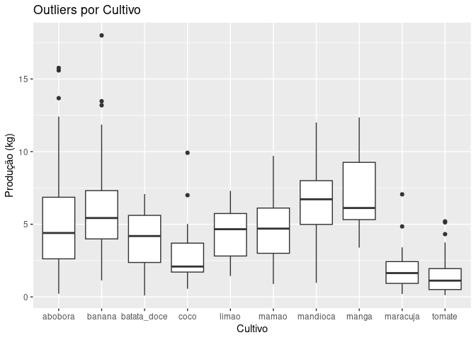

---
title: "Análise Exploratória de Dados – Sítio Mãeã Natureza"
author: "Victor Machado"
output: github_document
   toc: true
    toc_depth: 2
always_allow_html: true
---  
  
  
# Contexto  
  
O Sítio Mãeã Natureza é uma propriedade familiar de agricultura orgânica em sistema agroflorestal (SAF) que opera sob o modelo de Comunidade que Sustenta a Agricultura (CSA). Os associados pagam uma assinatura mensal e recebem, semanalmente, uma cota de produtos frescos.  
  
  
## Dados Disponíveis  
  
* **Registros de colheita**: data da colheita e tipos de cultivo.  
* **Registro de assinantes**: número de cotas ativas por mês.  
* **Limitações**: não há dados sobre plantio, como datas e quantidades plantadas. 
* Os arquivos originais estavam fragmentados por ano, mês e semana da colheita.  
  
  
## Objetivo  
  
Explorar os dados e a partir deles encontrar padrões que podem auxiliar na tomadas de decisões.
  
  
## Coleta e Consolidação dos Dados  
  
Os dados estavam espalhados em diversas planilhas, contendo informações adicionais que não são relevantes para esta análise. Foi necessário coletar manualmente os dados pertinentes às colheitas semanais de cada planilha. Posteriormente, esses dados foram consolidados em uma única base para facilitar a limpeza e análise.  
  
  
# Limpeza e Pré-Processamento dos Dados  
  

``` r
# Bibliotecas  

library(dplyr)
library(readr)
library(lubridate)
library(stringi)
library(stringr)
library(tidyr)
library(janitor)
library(ggplot2)
library(scales)
library(knitr)
```
  
  

``` r
# Carregar CSV

colheita <- read_csv("maea_colheita.csv")
coagricultores <- read_csv("maea_coagricultores.csv")
```
  
## Limpeza dataset *colheita*  
  

``` r
str (colheita)
```

```
## spc_tbl_ [3,433 × 4] (S3: spec_tbl_df/tbl_df/tbl/data.frame)
##  $ dia       : chr [1:3433] "01/02/2020" "01/02/2020" "01/02/2020" "01/02/2020" ...
##  $ partilha  : num [1:3433] 1 1 1 1 1 1 1 1 2 2 ...
##  $ cultivar  : chr [1:3433] "Batata Doce Branca" "Avocado" "Mamão Formosa" "Mini Moranga" ...
##  $ quantidade: num [1:3433] 34 20 14.5 6 5.5 5 3.5 1.4 25 17 ...
##  - attr(*, "spec")=
##   .. cols(
##   ..   dia = col_character(),
##   ..   partilha = col_double(),
##   ..   cultivar = col_character(),
##   ..   quantidade = col_double()
##   .. )
##  - attr(*, "problems")=<externalptr>
```
  
  
Corrigindo as categorias e formatação dos textos:
  

``` r
# Padronizar e formatar o texto

colheita <- colheita %>%
  clean_names() %>% # Padroniza nomes das colunas
  mutate(
    dia = dmy(dia), # Converte para data
    cultivar = str_trim( # Limpa espaços desnecessários
      str_replace_all( # Remove pontuações e caracteres especiais 
        stri_trans_general(str_to_lower(cultivar), "latin-ascii"), # Padroniza para minúsculas e remove acentos
        "[^a-zA-Z0-9 ]", ""
        )
      )
    ) %>%
  rename (id_partilha = partilha)

head(colheita,10)
```

```
## # A tibble: 10 × 4
##    dia        id_partilha cultivar           quantidade
##    <date>           <dbl> <chr>                   <dbl>
##  1 2020-02-01           1 batata doce branca       34  
##  2 2020-02-01           1 avocado                  20  
##  3 2020-02-01           1 mamao formosa            14.5
##  4 2020-02-01           1 mini moranga              6  
##  5 2020-02-01           1 rucula                    5.5
##  6 2020-02-01           1 almeirao branco           5  
##  7 2020-02-01           1 cebolinha                 3.5
##  8 2020-02-01           1 salsinha                  1.4
##  9 2020-02-08           2 batata doce branca       25  
## 10 2020-02-08           2 abacate bolinha          17
```
  
  
Verificando os nomes da coluna *cultivar*.  
  
  

``` r
head(unique(sort(colheita$cultivar)),50)
```

```
##  [1] "abacate"                     "abacate bolinha"            
##  [3] "abobora bege redonda"        "abobora brasileirinha"      
##  [5] "abobora caipira"             "abobora capiria"            
##  [7] "abobora caravela"            "abobora italiana"           
##  [9] "abobora japonesa casca lisa" "abobora jerimun"            
## [11] "abobora menina brasileira"   "abobora mini paulista"      
## [13] "abobora minipaulista"        "abobora moranga"            
## [15] "abobrinha italiana"          "abobrinha italiana caserta" 
## [17] "abobrinha menina brasileira" "acafrao da terra"           
## [19] "acerola"                     "agriao"                     
## [21] "alecrim"                     "alface"                     
## [23] "alface americana"            "alface americano"           
## [25] "alface baba de verao"        "alface crespa"              
## [27] "alface cria maea"            "alface crioula"             
## [29] "alface crioulo"              "alface elba"                
## [31] "alface lisa"                 "alface mimosa"              
## [33] "alface romana"               "alface roxo"                
## [35] "alfavacao cravo"             "alho poro"                  
## [37] "almeirao branco"             "almeirao caipira"           
## [39] "almeirao capiria"            "almeirao catalao"           
## [41] "almeirao hadiche"            "almeirao pao de acucar"     
## [43] "almeirao roxo"               "almeiraocatalao"            
## [45] "araca"                       "arvore do caril"            
## [47] "avocado"                     "banana maca"                
## [49] "banana nanica"               "banana nanicao"
```
  
  
Diversos nomes não padronizados. Há então a necessidade de corrigir os texto. 


``` r
# Correção de texto  

correcoes_cultivar <- c(
  "almeiraocatalao" = "almeirao catalao",   "almeirao capiria" = "almeirao caipira",  "abobora minipaulista" = "abobora mini paulista",  "abobrinha italiana caserta" = "abobrinha italiana",  "alface americano" = "alface americana",  "alface crioulo" = "alface crioula",  "abobora capiria" = "abobora caipira",  "arvore do caril" = "arvore_do_caril",  "batata doce branca" = "batata_doce branca",  "batata doce cenoura" = "batata_doce cenoura",  "batata doce laranja" = "batata_doce laranja",  "batata doce roxa" = "batata_doce roxa",  "brocoli" = "brocolis",  "brocoli e folha de brocoli" = "brocolis",  "cana do brejo" = "cana_do_brejo",  "capim cidreira" = "capim_cidreira",  "clitorea" = "clitoria",  "coco descascados" = "coco descascado",  "coracao de bananeira" = "coracao_de_bananeira",  "couve chinesa kyoto" = "couve chinesa",  "couve flor" = "couve_flor",  "couveflor" = "couve_flor",  "erva doce funcho" = "erva_doce funcho",  "erva doce funcho sementes" = "erva_doce funcho semente",  "flores de abobora" = "flor de abobora",  "flores de feijao borboleta" = "flor de feijao borboleta",  "folha mostarda" = "mostarda",  "folha de brocoli" = "folha_de_brocolis",  "folha do brocoli" = "folha_de_brocolis",  "jaboticaba" = "jabuticaba",  "jambuacu" = "jambu do para",  "jambuacu do para" = "jambu do para",  "jilo morro redondo" = "jilo redondo",  "lippia alba melissa" = "lippia_alba",  "lippia alba" = "lippia_alba",  "lippia albaa" = "lippia_alba",  "melissa" = "lippia_alba",  "melissa lippia" = "lippia_alba",  "avocado" = "abacate",  "grecco" = "grego",  "manjjericao folha larga" = "manjericao folha larga",  "maxixedonorte" = "maxixe do norte",  "mini moranga" = "abobora mini moranga",  "minimoranga" = "abobora mini moranga",  "moranguinha" = "abobora mini moranga",  "moranga" = "abobora moranga",  "ovos caipiras" = "ovos_caipira",  "ovos caipira" = "ovos_caipira",  "orapronobis" = "ora_pro_nobis",  "piment dedo de moca vermelho" = "pimenta dedo de moca vermelho",  "pimenta aji amarillo" = "pimenta aji amarela",  "clenson" = "clemson",  "sta cruz" = "santa cruz",  "rabano minowase" = "nabo japones",  "salsa" = "salsinha",  "vage de corda" = "vagem de corda",  "zinnea" = "flor zinnea",  "semente de erva doce funcho" = "erva_doce funcho semente",  "sementes de coentro" = "coentro semente",  "tomate cerea vermelho" = "tomate cereja vermelho",  "tomate cereja vermelho" = "tomate cereja",  "pimenta peruana aji amarela" = "pimenta aji amarela"
)
colheita <- colheita %>%
  mutate(
         cultivar = recode(cultivar, !!!correcoes_cultivar))

head(colheita,10)
```

```
## # A tibble: 10 × 4
##    dia        id_partilha cultivar             quantidade
##    <date>           <dbl> <chr>                     <dbl>
##  1 2020-02-01           1 batata_doce branca         34  
##  2 2020-02-01           1 abacate                    20  
##  3 2020-02-01           1 mamao formosa              14.5
##  4 2020-02-01           1 abobora mini moranga        6  
##  5 2020-02-01           1 rucula                      5.5
##  6 2020-02-01           1 almeirao branco             5  
##  7 2020-02-01           1 cebolinha                   3.5
##  8 2020-02-01           1 salsinha                    1.4
##  9 2020-02-08           2 batata_doce branca         25  
## 10 2020-02-08           2 abacate bolinha            17
```
  
  
Nota-se que os nomes do cultivos estão concatenados com os nomes das variedades dos cultivos. Separamos em duas colunas para facilitar a análise: 


``` r
# Cria duas colunas com cultivo e espécie  

colheita <- colheita %>%
  separate(cultivar, into = c("cultivo", "variedade"), sep = " ", extra = "merge", fill = "right") %>% 
  mutate(
   variedade = str_replace_all(
     str_trim(
       if_else(cultivo == variedade | is.na(variedade), NA_character_, variedade)),
     " ", "_"
   )
  )

head(colheita,10)
```

```
## # A tibble: 10 × 5
##    dia        id_partilha cultivo     variedade    quantidade
##    <date>           <dbl> <chr>       <chr>             <dbl>
##  1 2020-02-01           1 batata_doce branca             34  
##  2 2020-02-01           1 abacate     <NA>               20  
##  3 2020-02-01           1 mamao       formosa            14.5
##  4 2020-02-01           1 abobora     mini_moranga        6  
##  5 2020-02-01           1 rucula      <NA>                5.5
##  6 2020-02-01           1 almeirao    branco              5  
##  7 2020-02-01           1 cebolinha   <NA>                3.5
##  8 2020-02-01           1 salsinha    <NA>                1.4
##  9 2020-02-08           2 batata_doce branca             25  
## 10 2020-02-08           2 abacate     bolinha            17
```
  
  
Também já criaremos uma nova coluna agrupando os cultivos que pertencem ao mesmo grupo. 


``` r
# Criar coluna 'tipo_cultivo'  

colheita <- colheita %>%
  mutate(
    tipo_cultivo = case_when(
      # Frutas
      cultivo %in% c("abacate", "acerola", "araca", "banana", "caju", "goiaba",
                     "jabuticaba", "jambo", "lima", "limao", "mamao", "manga",
                     "maracuja", "melancia", "melao", "pitanga", "roma", "tamarindo", "uvaia",
                     "coco") ~ "fruta",
      # Hortaliças
      cultivo %in% c("agriao", "alface", "almeirao", "chicoria", "couve", "escarola",
                     "espinafre", "mostarda", "rucula", "alfavacao", "caruru", "jambu",
                     "peixinho", "taioba", "brocolis", "couve_flor", "folha_de_brocolis",
                     "repolho", "salsao", "ora_pro_nobis") ~ "hortalica",
      # Legumes
      cultivo %in% c("abobora", "abobrinha", "alho", "berinjela", "cebola", "chuchu", "feijao", "jilo",
                     "milho", "maxixe", "pepino", "pimenta", "quiabo", "tomate", "vagem") ~ "legume",
      # Tubérculos
      cultivo %in% c("batata", "batata_doce", "beterraba", "cara", "cenoura", "inhame",
                     "mandioca", "nabo", "rabanete") ~ "tuberculo",
      # Ervas
      cultivo %in% c("arvore_do_caril", "cebolinha", "salsinha", "coentro", "alecrim",
                     "manjericao", "manjerona", "menta", "tomilho", "hortela", "salvia",
                     "boldinho") ~ "ervas",
      # Plantas medicinais
      cultivo %in% c("acafrao", "camomila", "cana_do_brejo", "capim_cidreira", 
                     "citronela", "curcuma", "erva_doce", "lavanda", "lippia_alba",
                     "urucum", "gergelim", "clitoria") ~ "planta_medicinal",
      # Outros
      TRUE ~ "outros"
    )
  )

head(colheita,30)
```

```
## # A tibble: 30 × 6
##    dia        id_partilha cultivo     variedade    quantidade tipo_cultivo
##    <date>           <dbl> <chr>       <chr>             <dbl> <chr>       
##  1 2020-02-01           1 batata_doce branca             34   tuberculo   
##  2 2020-02-01           1 abacate     <NA>               20   fruta       
##  3 2020-02-01           1 mamao       formosa            14.5 fruta       
##  4 2020-02-01           1 abobora     mini_moranga        6   legume      
##  5 2020-02-01           1 rucula      <NA>                5.5 hortalica   
##  6 2020-02-01           1 almeirao    branco              5   hortalica   
##  7 2020-02-01           1 cebolinha   <NA>                3.5 ervas       
##  8 2020-02-01           1 salsinha    <NA>                1.4 ervas       
##  9 2020-02-08           2 batata_doce branca             25   tuberculo   
## 10 2020-02-08           2 abacate     bolinha            17   fruta       
## # ℹ 20 more rows
```
  
  

  
  
## Limpeza dataset *coagricultores*  
  
  

``` r
str (coagricultores)
```

```
## spc_tbl_ [134 × 4] (S3: spec_tbl_df/tbl_df/tbl/data.frame)
##  $ COAGRICULTORES: chr [1:134] "Prozaria" "Vitor e Annie" "Henrique e Denise" "Luana" ...
##  $ QT COTA       : chr [1:134] "9" "1" "1" "1" ...
##  $ ENTRADA       : chr [1:134] "01/02/2020" "01/02/2020" "01/02/2020" "01/02/2020" ...
##  $ SAÍDA         : chr [1:134] "01/04/2020" "01/07/2022" "01/10/2020" "01/07/2020" ...
##  - attr(*, "spec")=
##   .. cols(
##   ..   COAGRICULTORES = col_character(),
##   ..   `QT COTA` = col_character(),
##   ..   ENTRADA = col_character(),
##   ..   SAÍDA = col_character()
##   .. )
##  - attr(*, "problems")=<externalptr>
```
  

  
Necessário converter as datas. Também já iremos criar uma nova coluna calculando o tempo de permacência de cada coagricultor. Para anonimizar a análise, também criaremos um identificador único para cada coagricultor. 
  

``` r
# Padronização e limpeza dos dados.
  
coagricultores <- coagricultores %>%
  clean_names() %>%  # Converte nomes para: id_coagricultor, coagricultores, qt_cota, entrada, saida
  mutate(
    entrada = dmy(entrada),
    saida = dmy(if_else(is.na(saida) | saida == "", "01/06/2025", saida)),
    qt_cota = as.numeric(if_else(qt_cota == "0,5", "0.5", qt_cota)),
    permanencia = interval(entrada, saida) %/% months(1),
    id_coagricultor = row_number()
  ) %>%
  select(-coagricultores)

head(coagricultores,10)
```

```
## # A tibble: 10 × 5
##    qt_cota entrada    saida      permanencia id_coagricultor
##      <dbl> <date>     <date>           <dbl>           <int>
##  1       9 2020-02-01 2020-04-01           2               1
##  2       1 2020-02-01 2022-07-01          29               2
##  3       1 2020-02-01 2020-10-01           8               3
##  4       1 2020-02-01 2020-07-01           5               4
##  5       1 2020-02-01 2020-12-01          10               5
##  6       1 2020-02-01 2021-04-01          14               6
##  7       1 2020-02-01 2024-01-01          47               7
##  8       1 2020-02-01 2023-05-01          39               8
##  9       1 2020-02-01 2020-03-01           1               9
## 10       1 2020-02-01 2020-12-01          10              10
```

  

  
  
## Novos dados
  
Em contato com o agricultor foi informado o valor de cota ao longo do período para fazermos uma estimativa do faturamento.  
  
* De jan/2020 até dez/2024: 180,00  
* A partir de jan/2025: 220,00
  
Criamos nova coluna para calcular o total que cada coagricultor gerou ao longo de sua permanência, respeitando a mudança de preço em janeiro de 2025.  
  
  

``` r
# Criar coluna com valor de cotas total da pemanência por coagricultor

alteracao <- dmy("01-01-2025")

coagricultores <- coagricultores %>%
  mutate(
    meses_antes = interval(entrada, pmin(saida, alteracao)) %/% months(1),  # Meses ativos antes de jan/25
    meses_depois = interval(pmax(entrada, alteracao), saida) %/% months(1),   # Meses ativos depois de jan/25
    meses_antes  = pmax(meses_antes, 0),  # Padroniza valores negativos
    meses_depois = pmax(meses_depois, 0),
    valor_cota = qt_cota * (meses_antes * 180 + meses_depois * 220),  # Valor total de cotas
  ) %>%
  select(-meses_antes, -meses_depois)

head(coagricultores, 10)
```

```
## # A tibble: 10 × 6
##    qt_cota entrada    saida      permanencia id_coagricultor valor_cota
##      <dbl> <date>     <date>           <dbl>           <int>      <dbl>
##  1       9 2020-02-01 2020-04-01           2               1       3240
##  2       1 2020-02-01 2022-07-01          29               2       5220
##  3       1 2020-02-01 2020-10-01           8               3       1440
##  4       1 2020-02-01 2020-07-01           5               4        900
##  5       1 2020-02-01 2020-12-01          10               5       1800
##  6       1 2020-02-01 2021-04-01          14               6       2520
##  7       1 2020-02-01 2024-01-01          47               7       8460
##  8       1 2020-02-01 2023-05-01          39               8       7020
##  9       1 2020-02-01 2020-03-01           1               9        180
## 10       1 2020-02-01 2020-12-01          10              10       1800
```
  

    
    

    
    
  


## Coleta e limpeza do dataset *meteorologia*  
  
Para traçar análises mais completas, também foram coletados dados meteorológicos diários de janeiro/2020 à maio/2025 pelo portal do [INMET - Instituto Nacional de Meteorologia](https://portal.inmet.gov.br/) e organizados em um arquivo CSV.


``` r
meteorologia <- read_csv("maea_meteorologia.csv")

head(meteorologia)
```

```
## # A tibble: 6 × 8
##   Data      Temperatura (°C) Mín…¹ Temperatura (°C) Méd…² Temperatura (°C) Máx…³
##   <chr>     <chr>                                   <dbl>                  <dbl>
## 1 01-01-20… 22.35                                    27.7                   33.1
## 2 02-01-20… 21.69                                    27.0                   32.3
## 3 03-01-20… 20.67                                    25.7                   30.6
## 4 04-01-20… 20.4                                     25.1                   29.8
## 5 05-01-20… 20.29                                    25.1                   29.9
## 6 06-01-20… 20.7                                     25.2                   29.7
## # ℹ abbreviated names: ¹​`Temperatura (°C) Mínima`, ²​`Temperatura (°C) Média`,
## #   ³​`Temperatura (°C) Máxima`
## # ℹ 4 more variables: `Umidade do ar (mm) Mínima` <dbl>,
## #   `Umidade do ar (mm) Média` <dbl>, `Umidade do ar (mm) Máxima` <dbl>,
## #   `Precipitação (mm)` <chr>
```
  
    

``` r
str(meteorologia)
```

```
## spc_tbl_ [1,977 × 8] (S3: spec_tbl_df/tbl_df/tbl/data.frame)
##  $ Data                     : chr [1:1977] "01-01-2020" "02-01-2020" "03-01-2020" "04-01-2020" ...
##  $ Temperatura (°C) Mínima  : chr [1:1977] "22.35" "21.69" "20.67" "20.4" ...
##  $ Temperatura (°C) Média   : num [1:1977] 27.7 27 25.7 25.1 25.1 ...
##  $ Temperatura (°C) Máxima  : num [1:1977] 33.1 32.3 30.6 29.8 29.9 ...
##  $ Umidade do ar (mm) Mínima: num [1:1977] 41.4 44.4 50.9 56.2 52.5 ...
##  $ Umidade do ar (mm) Média : num [1:1977] 63 64.5 71.9 74.4 72.6 ...
##  $ Umidade do ar (mm) Máxima: num [1:1977] 84.6 84.6 92.8 92.6 92.8 92.6 92 92.6 92.1 93.6 ...
##  $ Precipitação (mm)        : chr [1:1977] "0" "24.38" "19.81" "9.4" ...
##  - attr(*, "spec")=
##   .. cols(
##   ..   Data = col_character(),
##   ..   `Temperatura (°C) Mínima` = col_character(),
##   ..   `Temperatura (°C) Média` = col_double(),
##   ..   `Temperatura (°C) Máxima` = col_double(),
##   ..   `Umidade do ar (mm) Mínima` = col_double(),
##   ..   `Umidade do ar (mm) Média` = col_double(),
##   ..   `Umidade do ar (mm) Máxima` = col_double(),
##   ..   `Precipitação (mm)` = col_character()
##   .. )
##  - attr(*, "problems")=<externalptr>
```
  
  
Corrigindo as categorias e formatação dos textos:  
  

``` r
# Padronização e formatação

meteorologia <- meteorologia %>%
  rename_with(~ c("data","temp_min", "temp_med", "temp_max", "umid_min", "umid_med", "umid_max", "precip")) %>% # Altera nomes das colunas. 
  mutate(data = dmy(data), # Converte formato da data
         across(-c(data), as.numeric)) # Converte todas colunas para num, exceto data)
  
  
head(meteorologia)
```

```
## # A tibble: 6 × 8
##   data       temp_min temp_med temp_max umid_min umid_med umid_max precip
##   <date>        <dbl>    <dbl>    <dbl>    <dbl>    <dbl>    <dbl>  <dbl>
## 1 2020-01-01     22.4     27.7     33.1     41.4     63.0     84.6   0   
## 2 2020-01-02     21.7     27.0     32.3     44.4     64.5     84.6  24.4 
## 3 2020-01-03     20.7     25.7     30.6     50.9     71.9     92.8  19.8 
## 4 2020-01-04     20.4     25.1     29.8     56.2     74.4     92.6   9.4 
## 5 2020-01-05     20.3     25.1     29.9     52.5     72.6     92.8   4.32
## 6 2020-01-06     20.7     25.2     29.7     58.8     75.7     92.6   3.30
```
  

    
   
# Análise Descritiva dos Dados  
  
## Resumo da produção por cultivo
  
Criamos um resumo dos dados dos cultivos para melhor analisarmos. 
  

``` r
# Resumo da produção por cultivo

producao_resumo <- colheita %>%
  group_by(cultivo) %>%
  summarise(
    total_kg = sum(quantidade, na.rm = TRUE),
    media_kg = mean(quantidade, na.rm = TRUE),
    mediana_kg = median(quantidade, na.rm = TRUE),
    min_kg = min(quantidade, na.rm = TRUE),
    max_kg = max(quantidade, na.rm = TRUE),
    desvio_padrao = sd(quantidade, na.rm = TRUE),
    n_colheitas = n(),
    n_partilhas = n_distinct(id_partilha)
  ) %>%
  arrange(desc(total_kg))


# Arredonda as colunas numéricas com 2 casas decimais antes de exibir
producao_resumo_kable <- producao_resumo %>%
  mutate(across(
    c(total_kg, media_kg, mediana_kg, min_kg, max_kg, desvio_padrao),
    ~ round(., 2)
  ))

# Exibe tabela com kable (compatível com Markdown e GitHub)
kable(
  producao_resumo_kable,
  format = "markdown"
)
```


|cultivo              | total_kg| media_kg| mediana_kg| min_kg| max_kg| desvio_padrao| n_colheitas| n_partilhas|
|:--------------------|--------:|--------:|----------:|------:|------:|-------------:|-----------:|-----------:|
|mandioca             |  1603.69|    11.21|       9.44|   0.97|  29.80|          6.45|         143|         129|
|batata_doce          |  1448.13|     9.59|       6.30|   0.10|  34.00|          7.68|         151|         109|
|manga                |  1124.47|    17.04|      11.57|   1.08|  89.50|         16.23|          66|          36|
|abobora              |  1045.39|     6.92|       4.94|   0.22|  41.14|          6.71|         151|          88|
|banana               |   794.63|     5.64|       5.35|   0.43|  18.00|          2.77|         141|         109|
|alface               |   719.79|     4.50|       3.09|   0.10|  17.85|          4.39|         160|         130|
|mamao                |   565.12|     6.42|       4.80|   0.89|  32.30|          6.10|          88|          67|
|tomate               |   433.31|     3.39|       2.45|   0.12|  20.41|          3.43|         128|          98|
|quiabo               |   379.48|     3.01|       1.90|   0.27|  19.97|          3.34|         126|          95|
|batata               |   356.21|    14.25|      11.26|   2.88|  36.21|          8.64|          25|          19|
|almeirao             |   355.66|     3.20|       2.17|   0.10|  11.67|          2.97|         111|          89|
|cenoura              |   305.94|     5.77|       6.09|   0.54|  15.04|          3.19|          53|          50|
|berinjela            |   280.39|     9.04|       6.43|   1.00|  25.90|          6.21|          31|          31|
|abacate              |   277.04|    11.54|       6.97|   2.24|  30.00|          9.17|          24|          21|
|coco                 |   235.69|     5.01|       3.04|   0.56|  28.96|          5.99|          47|          47|
|milho                |   217.15|     8.04|       6.21|   1.00|  25.40|          5.77|          27|          21|
|couve                |   214.76|     4.38|       2.00|   0.34|  26.90|          5.75|          49|          48|
|pepino               |   214.48|     6.13|       4.08|   0.50|  30.16|          6.47|          35|          32|
|rucula               |   210.04|     3.04|       2.69|   0.13|  12.50|          2.55|          69|          63|
|jilo                 |   193.51|     2.30|       1.44|   0.33|   9.53|          2.10|          84|          70|
|maracuja             |   188.96|     2.70|       2.30|   0.20|  10.33|          1.92|          70|          62|
|rabanete             |   177.41|     3.11|       2.60|   0.24|  12.60|          2.53|          57|          56|
|limao                |   171.61|     4.64|       4.66|   1.44|  14.14|          2.25|          37|          35|
|chicoria             |   154.50|     3.86|       3.59|   0.10|  12.00|          2.84|          40|          34|
|abobrinha            |   129.36|     7.19|       5.82|   0.24|  29.47|          7.10|          18|          17|
|melancia             |   129.24|    18.46|      17.02|   3.00|  36.77|         15.26|           7|           5|
|maxixe               |   124.98|     2.15|       1.54|   0.33|  10.67|          2.03|          58|          56|
|nabo                 |    98.87|     4.94|       4.91|   0.59|  13.95|          3.37|          20|          20|
|couve_flor           |    94.82|    18.96|      17.04|   8.40|  35.41|         10.58|           5|           5|
|mostarda             |    92.32|     7.10|       5.20|   1.83|  17.01|          5.83|          13|          13|
|erva_doce            |    78.83|     5.63|       6.50|   0.03|  14.12|          4.57|          14|          14|
|tamarindo            |    77.96|     3.71|       3.09|   0.38|  10.00|          2.27|          21|          21|
|vagem                |    70.97|     0.96|       0.45|   0.11|   6.80|          1.25|          74|          60|
|lippia_alba          |    70.04|     0.45|       0.43|   0.09|   1.33|          0.19|         157|         148|
|salsinha             |    65.98|     0.86|       0.76|   0.07|   2.85|          0.57|          77|          73|
|escarola             |    65.86|     6.59|       5.81|   1.45|  12.00|          3.50|          10|          10|
|hortela              |    65.61|     0.41|       0.26|   0.04|   3.30|          0.47|         160|         121|
|brocolis             |    64.05|     2.91|       1.19|   0.31|   9.06|          3.19|          22|          22|
|repolho              |    60.24|    15.06|      15.01|   8.72|  21.49|          5.75|           4|           4|
|cebolinha            |    54.41|     0.95|       0.40|   0.06|   5.36|          1.24|          57|          50|
|alho                 |    48.89|     1.69|       1.15|   0.25|   5.00|          1.30|          29|          23|
|beldroega            |    40.92|     2.05|       2.02|   0.28|   5.00|          1.20|          20|          18|
|jabuticaba           |    32.02|     3.20|       3.27|   0.20|   7.09|          2.27|          10|          10|
|cebola               |    26.89|     5.38|       2.66|   1.53|  14.10|          5.36|           5|           4|
|feijao               |    23.71|     5.93|       4.96|   0.10|  13.70|          6.44|           4|           4|
|inhame               |    22.07|    11.04|      11.04|  10.61|  11.46|          0.60|           2|           2|
|manjericao           |    20.89|     0.25|       0.17|   0.02|   1.56|          0.26|          85|          65|
|capim_cidreira       |    19.69|     0.41|       0.38|   0.09|   1.00|          0.21|          48|          48|
|ora_pro_nobis        |    19.14|     0.39|       0.40|   0.07|   0.88|          0.17|          49|          46|
|espinafre            |    18.94|     0.86|       0.37|   0.10|   4.16|          1.08|          22|          17|
|pimenta              |    17.27|     0.38|       0.26|   0.02|   2.00|          0.40|          45|          39|
|salsao               |    17.03|     1.70|       1.93|   0.22|   2.63|          0.84|          10|          10|
|folha_de_brocolis    |    13.54|     4.51|       4.82|   3.30|   5.42|          1.09|           3|           3|
|acafrao              |    10.54|     0.62|       0.50|   0.14|   1.65|          0.46|          17|          17|
|coracao_de_bananeira |     9.71|     4.86|       4.86|   4.50|   5.21|          0.50|           2|           2|
|caju                 |     9.30|     1.86|       2.00|   0.28|   2.89|          1.06|           5|           5|
|monguba              |     8.92|     1.49|       1.48|   0.65|   2.10|          0.54|           6|           6|
|coentro              |     8.85|     0.42|       0.37|   0.02|   1.10|          0.29|          21|          21|
|urucum               |     8.44|     0.34|       0.24|   0.08|   0.82|          0.25|          25|          25|
|ovos_caipira         |     7.80|     1.95|       1.90|   1.50|   2.50|          0.53|           4|           4|
|taioba               |     7.75|     0.43|       0.46|   0.17|   0.62|          0.15|          18|          18|
|lima                 |     7.00|     7.00|       7.00|   7.00|   7.00|            NA|           1|           1|
|pitanga              |     6.86|     1.14|       1.06|   0.63|   1.71|          0.50|           6|           6|
|beterraba            |     6.45|     3.22|       3.22|   0.95|   5.50|          3.22|           2|           2|
|melao                |     6.34|     0.70|       0.02|   0.01|   6.17|          2.05|           9|           9|
|acerola              |     6.24|     2.08|       2.66|   0.88|   2.70|          1.04|           3|           3|
|caruru               |     5.13|     1.28|       1.25|   0.33|   2.30|          1.01|           4|           4|
|araca                |     4.48|     1.12|       1.16|   0.16|   2.00|          0.79|           4|           4|
|uvaia                |     4.43|     2.21|       2.21|   1.53|   2.90|          0.97|           2|           2|
|lavanda              |     4.32|     0.07|       0.05|   0.01|   0.50|          0.08|          60|          55|
|curcuma              |     4.22|     0.42|       0.35|   0.21|   0.84|          0.20|          10|          10|
|chuchu               |     3.82|     3.82|       3.82|   3.82|   3.82|            NA|           1|           1|
|cara                 |     3.78|     1.26|       1.19|   1.02|   1.57|          0.28|           3|           3|
|flor                 |     3.14|     0.11|       0.07|   0.01|   0.54|          0.11|          29|          22|
|alfavacao            |     2.87|     0.21|       0.17|   0.04|   0.51|          0.16|          14|          13|
|peixinho             |     2.82|     0.56|       0.71|   0.18|   0.85|          0.32|           5|           5|
|alecrim              |     2.52|     0.02|       0.01|   0.00|   0.18|          0.03|         107|         105|
|cana_do_brejo        |     2.44|     0.41|       0.39|   0.25|   0.72|          0.16|           6|           6|
|jambu                |     2.21|     0.14|       0.01|   0.01|   0.60|          0.21|          16|          16|
|gergelim             |     1.81|     0.60|       0.80|   0.05|   0.96|          0.49|           3|           3|
|cosmos               |     1.80|     0.06|       0.03|   0.01|   0.28|          0.07|          28|          22|
|goiaba               |     1.46|     0.73|       0.73|   0.57|   0.89|          0.23|           2|           2|
|agriao               |     1.43|     1.43|       1.43|   1.43|   1.43|            NA|           1|           1|
|citronela            |     1.17|     0.58|       0.58|   0.30|   0.87|          0.40|           2|           2|
|boldinho             |     1.00|     1.00|       1.00|   1.00|   1.00|            NA|           1|           1|
|salvia               |     0.97|     0.07|       0.06|   0.01|   0.19|          0.05|          14|          14|
|tomilho              |     0.89|     0.09|       0.08|   0.01|   0.20|          0.07|          10|           7|
|jambo                |     0.67|     0.34|       0.34|   0.15|   0.52|          0.26|           2|           2|
|roma                 |     0.56|     0.56|       0.56|   0.56|   0.56|            NA|           1|           1|
|clitoria             |     0.41|     0.02|       0.02|   0.00|   0.07|          0.02|          17|          16|
|arvore_do_caril      |     0.30|     0.15|       0.15|   0.03|   0.27|          0.17|           2|           2|
|bucha                |     0.27|     0.14|       0.14|   0.07|   0.20|          0.09|           2|           2|
|manjerona            |     0.10|     0.03|       0.02|   0.01|   0.05|          0.02|           4|           4|
|camomila             |     0.05|     0.05|       0.05|   0.05|   0.05|            NA|           1|           1|
|menta                |     0.01|     0.01|       0.01|   0.01|   0.01|            NA|           1|           1|
  
  

  
  
Olhando para a tabela, podemos perceber que mandioca, batata doce, manga e abóbora são os pilares do volume de produção. Banana, alface, mamão, tomate, quiabo e batata completam o top 10, mostrando que o sítio tem uma diversidade de produtos com volumes relevantes, embora menores que os quatro primeiros.  

Alface se destaca por ser o cultivo com maior número de colheita, apesar de ser somente o sexto em volume. Isso sugere que a alface é um cultivo de colheita muito frequente mesmo que em quantidades menores. Manga e batata têm uma quantidade de colheitas notavelmente menor em comparação com peso total colhido. Isso é um forte indicativo de que a produção desses cultivos é mais concentrada em poucos eventos de colheita, que resultam em grandes volumes.  
  
Podemos notar que alguns cultivos como lima, chuchu, agriao, boldinho, roma, camomila e menta estiveram presentes em apenas uma única colheita e partilha. Indício de que esses cultivos não se mostraram tão rentáveis como esperado e foram descontinuados. 
  

### Estabilidade da produção 
  

Vamos primeiro olhar para uma série temporal dos 20 principais cultivos ao longo dos meses.
  

``` r
library(forcats)

# Agrupar por mês e cultivo
serie_mensal <- colheita %>%
  mutate(mes = floor_date(dia, unit = "month")) %>%
  group_by(mes, cultivo) %>%
  summarise(total_kg = sum(quantidade, na.rm = TRUE), .groups = "drop")

# Identificar os 20 cultivos com maior produção total
top20_cultivos <- serie_mensal %>%
  group_by(cultivo) %>%
  summarise(total_geral = sum(total_kg)) %>%
  arrange(desc(total_geral)) %>%
  slice_head(n = 20)

# Reordenar o fator cultivo
serie_top20 <- serie_mensal %>%
  filter(cultivo %in% top20_cultivos$cultivo) %>%
  mutate(cultivo = fct_relevel(cultivo, top20_cultivos$cultivo))

# Gerar gráfico
ggplot(serie_top20, aes(x = mes, y = total_kg)) +
  geom_line(color = "darkgreen") +
  facet_wrap(~ cultivo, scales = "free_y", ncol = 4) +
  labs(
    title = "Evolução da Produção Mensal – Top 20 Cultivos por Kg Total",
    x = "Mês",
    y = "Kg colhidos"
  ) +
  theme_minimal(base_size = 12) +
  scale_x_date(date_breaks = "3 months", date_labels = "%b %Y") +
  theme(
    axis.text.x = element_text(angle = 45, hjust = 1),
    strip.text = element_text(face = "bold")
  )
```

<!-- -->
  
  
  
Observamos que diversos cultivos apresentam picos de produção concentrados em determinados meses, reforçando uma dinâmica fortemente sazonal. Abóbora, por exemplo, tem uma produção expressiva entre dezembro e março, mas é praticamente ausente em outros meses. Manga e outro cultivo que deixa explicitado esse efeito, com picos muito altos em novembro e dezembro.  

Alguns cultivos apresentam total de colheita muito maiores, como a própria manga e abóbora, enquanto outros têm colheitas constantes porém com valores mais baixos, como é o caso da mandioca, que no resumo da produção se mostrou como o cultivo com maior quantidade produzida no período.  

Outro ponto que fica claro ao observarmos os gráficos é a mudança no cultivos ao longo do tempo. Berinjela, couve, quiabo e abacate, por exemplo, tinham números relevantes de colheitas no início do período, mas perderam expressão ao longo do tempo até cessar o cultivo por completo. Isso pode demonstrar uma mudança no modelo de produção.

### Variedade de cultivos ao longo do período 
  
Para verificar a possível mudança do modelo de produção, vamos plotar a alteração na variedade de cultivos diferentes ao longo do período.  
  

``` r
# Contar cultivos únicos por mês
cultivos_por_mes <- colheita %>%
  mutate(mes = floor_date(dia, unit = "month")) %>%
  group_by(mes) %>%
  summarise(n_cultivos = n_distinct(cultivo))

# Gerar gráfico
ggplot(cultivos_por_mes, aes(x = mes, y = n_cultivos)) +
  geom_line(color = "#1b7837", linewidth = 1.2) +
  geom_point(color = "#00441b", size = 2) +
  labs(
    title = "Número de Cultivos Diferentes Registrados por Mês",
    x = "Mês",
    y = "Quantidade de Cultivos Únicos"
  ) +
  theme_minimal(base_size = 12) +
  scale_x_date(date_labels = "%b %Y", date_breaks = "3 months") +
  theme(axis.text.x = element_text(angle = 45, hjust = 1))
```

<!-- -->
  
Ao analisarmos o gráfico de variedades colhidas por mês, podemos notar entre janeiro de 2021 e maio de 2022, encontra-se o período de maior consistência e diversidade de cultivos, com destaque para dezembro de 2021, com o pico de 42 cultivos diferentes. Após junho de 2022, inicia-se um declínio visível, com diversos meses abaixo de 20 cultivos, tendo fevereiro de 2025 como o ponto crítico, com apenas 9 cultivos.
  
É perceptível também que os meses mais quentes (dezembro a março) apresentam maior diversidade, sugerindo que os meses de verão favorecem uma maior variedade de cultivos.
  

## Resumo da produção por tipo de cultivo  
  
   
Vamos verificar as estatísticas básicas de um resumo de produção por tipo de cultivo.
  
  

``` r
producao_resumo_tipo <- colheita %>%
  group_by(tipo_cultivo) %>%
  summarise(
    total_kg = sum(quantidade, na.rm = TRUE),
    media_kg = mean(quantidade, na.rm = TRUE),
    mediana_kg = median(quantidade, na.rm = TRUE),
    min_kg = min(quantidade, na.rm = TRUE),
    max_kg = max(quantidade, na.rm = TRUE),
    desvio_padrao = sd(quantidade, na.rm = TRUE),
    n_colheitas = n(),
    n_partilhas = n_distinct(id_partilha)
  ) %>%
  arrange(desc(total_kg))

head(producao_resumo_tipo,10)
```

```
## # A tibble: 7 × 9
##   tipo_cultivo     total_kg media_kg mediana_kg min_kg max_kg desvio_padrao
##   <chr>               <dbl>    <dbl>      <dbl>  <dbl>  <dbl>         <dbl>
## 1 tuberculo          4023.     8.82        6.84   0.1   36.2          6.99 
## 2 fruta              3644.     6.67        4.47   0.01  89.5          8.41 
## 3 legume             3210.     3.93        2.20   0.02  41.1          4.94 
## 4 hortalica          2123.     3.40        1.9    0.01  35.4          4.23 
## 5 ervas               222.     0.411       0.2    0      5.36         0.621
## 6 planta_medicinal    202.     0.561       0.35   0     14.1          1.37 
## 7 outros               72.6    0.797       0.12   0.01   5.21         1.21 
## # ℹ 2 more variables: n_colheitas <int>, n_partilhas <int>
```
   
   
Analisando a tabela podemos fazer algumas observações:  

* Tubérculos, frutas e legumes são as categorias com maior volume total de produção, seguidas por hortaliças. Ervas, plantas medicinais e outros têm volumes menores, o que é esperado.  
  
* Tubérculos e frutas apresentam as maiores quantidades médias e medianas por colheita, indicando que uma única colheita desses tipos rende mais. Ervas e Plantas Medicinais têm quantidades típicas muito menores por colheita.  
  
* O alto desvio padrão das frutas sugerem grandes diferenças nas quantidades colhidas por partilha. Tubérculos também têm variabilidade considerável, enquanto Ervas e Plantas Medicinais são mais consistentes.  
  
* Legumes têm o maior número de colheitas, indicando que são colhidos com muita frequência, embora em quantidades menores por colheita. O número de partilhas é relativamente alto para todas as categorias principais, sugerindo que a maioria dos tipos de cultivo é distribuída em muitas partilhas diferentes.  
  
* Em todas as categorias a média é maior que a mediana. Isso indica uma distribuição assimétrica, onde a maioria das colheitas tem quantidades menores, mas existem algumas colheitas excepcionalmente grandes que elevam a média para todos os tipos de cultivo.
  
  
### Evolução da diversidade de culturas por tipo de cultivo.
  
  
Vamos avaliar agora quais tipos de cultivo se mostraram mais promissores e efetivos ao longo do tempo através de um gráfico que mostra a evolução da variedade de cultivos de um tipo específico. Incluremos também um linha de tendência para facilitar a visualização da evolução temporal.  
  
  

``` r
# Cria a coluna para mês

colheita <- colheita %>%
  mutate(mes = floor_date(dia, unit = "month"))

# Agrupar por mês e tipo de cultivo

cultivos_por_tipo_mes <- colheita %>%
  group_by(mes, tipo_cultivo) %>%
  summarise(n_cultivos = n_distinct(cultivo), .groups = "drop")

ggplot(cultivos_por_tipo_mes, aes(x = mes, y = n_cultivos)) +
  geom_line(color = "#1f77b4", linewidth = 0.5, alpha = 0.5) +
  geom_point(color = "#1f77b4", size = 0.5) +
  geom_smooth(
    method = "lm",
    se = FALSE,
    linewidth = 1,
    linetype = "dashed",
    color = "#d62728"
  ) +
  scale_x_date(date_labels = "%b/%Y", date_breaks = "2 months", expand = c(0, 0)) +
  scale_y_continuous(expand = expansion(mult = c(0, 0.05))) +
  labs(
    title = "Tendência da Diversidade de Cultivos por Tipo",
    x = "Mês",
    y = "Nº de Cultivos Distintos"
  ) +
  facet_wrap(~ tipo_cultivo, scales = "free_y") +
  theme_minimal(base_size = 13) +
  theme(
    axis.text.x = element_text(angle = 45, hjust = 1),
    strip.text = element_text(face = "bold"),
    legend.position = "none"
  )
```

<!-- -->
  
  
Podemos notar nos gráficos que inicialmente há um crescimento de diversidade de cultivos entre 2020 e 2021, destaque para hortaliças e legumes. Em 2022 há uma certa estabilidade de maneira geral, mas já apresenta oscilações maiores, especialmente em hortaliças e frutas. A partir de 2023 já observa-se uma redução generalizada da diversidade, com algumas hortaliças e tubérculos com apenas 1 representante. Apenas as frutas mantiveram relativamente constante. 

Isso pode indicar redução da variedade ofertada, possível mudança estratégica na produção (foco em menos cultivos), escassez de mão de obra ou efeitos de sazonalidade e demanda.
  
  
  
# Top 10 cultivos com maior produção do período de 2023 a 2025

Como já observamos uma mudança evidente na quantidade de diversidade e na alterações de plantios principais ao longo do período, a partir de agora focaremos em analisar os principais cultivos desde janeiro de 2023.   
  
  

``` r
# Top 10 cultivos com maior produção de 2023 a 2025

top10_cultivos<- colheita %>%
  filter(dia >= as.Date("2023-01-01")) %>%
  group_by(cultivo) %>%
  summarise(total_kg = sum(quantidade, na.rm = TRUE)) %>%
  arrange(desc(total_kg)) %>%
  slice_head(n = 10)

top10_cultivos
```

```
## # A tibble: 10 × 2
##    cultivo     total_kg
##    <chr>          <dbl>
##  1 banana         651. 
##  2 mandioca       379. 
##  3 abobora        293. 
##  4 mamao          212. 
##  5 batata_doce    155. 
##  6 limao          153. 
##  7 coco           105. 
##  8 manga           92.6
##  9 tomate          81.2
## 10 maracuja        59.4
```

  
  
# Identificação e análise de outliers dos 10 principais cultivos do período de 2023 a 2025?
  
  
Exploraremos agora os outliers do Top 10 cultivos dos últimos 2 anos para melhor compreender o fenômeno. Para isso, geraremos um boxplot por cultivo por mês. 
  
  

``` r
# Filtrar dados do Top10 partir de janeiro de 2023

colheita_filtrada <- colheita %>%
  filter(
    cultivo %in% top10_cultivos$cultivo,
    mes >= as.Date("2023-01-01")
  )

# Boxplot por cultivo por mês

ggplot(colheita_filtrada, aes(x = cultivo, y = quantidade)) +
  geom_boxplot() +
  labs(title = "Outliers por Cultivo", x = "Cultivo", y = "Produção (kg)")
```

<!-- -->

  
É notável que a amplitude da produção varia bastante entre os cultivos. Itens como mandioca, banana e abóbora apresentam maior dispersão nos valores de produção, enquanto batata-doce e tomate possuem distribuições mais concentradas. Cinco dos dez principais cultivos possuem outliers, com destaque para banana, abóbora e mandioca, que mostram valores de produção significativamente acima da mediana. Esses valores sugerem que foram colheitas excepcionais.  
A maioria dos cultivos também possuem uma cauda superior alongada, ou seja, de modo geral, as colheitas desses itens são menores, mas possuem alguns poucos registros com produções elevadas.  
  
  
## Classificando os outliers  
  
  
Para compreender ainda mais o fenômeno, vamos classificar as ocorrências de outliers no dataset utilizando o método IQR:  
  
  

``` r
# Classificando outliers

colheita_outliers <- colheita_filtrada %>%
  group_by(cultivo) %>%
  mutate(
    Q1 = quantile(quantidade, 0.25, na.rm = TRUE),
    Q3 = quantile(quantidade, 0.75, na.rm = TRUE),
    IQR = Q3 - Q1,
    outlier = quantidade < (Q1 - 1.5 * IQR) | quantidade > (Q3 + 1.5 * IQR)
  )
colheita_outliers
```

```
## # A tibble: 492 × 11
## # Groups:   cultivo [10]
##    dia        id_partilha cultivo   variedade quantidade tipo_cultivo mes       
##    <date>           <dbl> <chr>     <chr>          <dbl> <chr>        <date>    
##  1 2023-01-06         153 mandioca  branca          8    tuberculo    2023-01-01
##  2 2023-01-06         153 batata_d… branca          7.08 tuberculo    2023-01-01
##  3 2023-01-06         153 abobora   bege_red…       5.57 legume       2023-01-01
##  4 2023-01-06         153 batata_d… roxa            0.35 tuberculo    2023-01-01
##  5 2023-01-06         153 batata_d… cenoura         0.1  tuberculo    2023-01-01
##  6 2023-01-13         154 banana    prata           8.84 fruta        2023-01-01
##  7 2023-01-13         154 mandioca  branca          8.45 tuberculo    2023-01-01
##  8 2023-01-13         154 batata_d… branca          5.59 tuberculo    2023-01-01
##  9 2023-01-13         154 abobora   bege_red…       6.86 legume       2023-01-01
## 10 2023-01-13         154 abobora   mini_mor…       0.81 legume       2023-01-01
## # ℹ 482 more rows
## # ℹ 4 more variables: Q1 <dbl>, Q3 <dbl>, IQR <dbl>, outlier <lgl>
```
  
  
## Quantos outliers há por cultivo?  

Podemos identificar agora qual o número de ocorrências de outliers por cultivo.


``` r
# Contar outliers por cultivo

outliers_por_cultivo <- colheita_outliers %>%
  filter(outlier) %>%
  count(cultivo, name = "n_outliers") %>%
  arrange(desc(n_outliers))

ggplot(outliers_por_cultivo, aes(x = reorder(cultivo, n_outliers), y = n_outliers)) +
  geom_col(fill="orange") +
  labs(title = "Número de Outliers por Cultivo", x = "Cultivo", y = "Nº de Outliers") +
  theme_minimal()
```

<!-- -->

Abóbora, banana e tomate são os cultivos que apresentam a maior quantidade de outliers no período, seguido de côco e maracujá.  
  
  
## Em quais mêses ocorreram mais outliers?  
  
Vamos olhar agora se há alguma relação com a época do ano com a ocorrência dos outliers.


``` r
# Contar outliers por mês

outliers_por_mes <- colheita_outliers %>%
  filter(outlier) %>%
  count(mes, name = "n_outliers") %>%
  arrange(desc(n_outliers))


ggplot(outliers_por_mes, aes(x = mes, y = n_outliers)) +
  geom_line(color = "steelblue", linewidth = 1) +
  geom_point(size = 2) +
  labs(title = "Frequência de Outliers por Mês", x = "Mês", y = "Nº de Outliers") +
  theme_minimal()
```

<!-- -->
  
Podemos observar que setembro de 2023 foi o mes com maior número de outlier (4) e logo em seguida temos março de 2023 e janeiro de 2025 com 2 outliers cada. Apesar disso, não é possível apontar uma sazonalidade a partir dos outliers, pois apesar de ocorrerem diversos outliers com cultivos diferentes no mesmo mês, o mesmo efeito não se repetiu nos demais anos. 
  
  
## Qual a proporção de ocorrências de outliers por cultivo no período?  
  
  
Para compreender o quanto da produção total corresponde aos outliers, podemos gerar um gráfico comparativo calculando o total de registros de colheita de cada cultivo e a quantidade de ocorrências de outliers por cultivo.


``` r
# Total de registro de colheita por cultivo

total_por_cultivo <- colheita_outliers %>%
  group_by(cultivo) %>%
  summarise(n_total = n(), .groups = "drop")

# Número de outliers por cultivo

outliers_por_cultivo_prop <- colheita_outliers %>%
  filter(outlier) %>%
  count(cultivo, name = "n_outliers") %>%
  left_join(total_por_cultivo, by = "cultivo") %>%
  mutate(proporcao = n_outliers / n_total) %>%
  arrange(desc(proporcao))

ggplot(outliers_por_cultivo_prop, aes(x = reorder(cultivo, proporcao), y = proporcao)) +
  geom_col(fill = "darkorange") +
  coord_flip() +
  scale_y_continuous(labels = scales::percent_format(accuracy = 1)) +
  labs(title = "Proporção de Outliers por Cultivo", x = "Cultivo", y = "Proporção (%)") +
  theme_minimal()
```

<!-- -->
  
  
Ao olharmos as proporções das ocorrências de outliers, percebemos que são eventos esporádicos. Apenas o maracujá chama atenção por cerca de 6% de sua produção ser de outliers. Vamos investigar as condições específicas (climáticas, de manejo) nos 30 dias que antecederam esses outliers de maracujá para entender o que os causou.
  


``` r
# Filtrar apenas os outliers de maracujá

maracuja_outliers <- colheita_outliers %>%
  filter(cultivo == "maracuja", outlier == TRUE) %>%
  select(dia, quantidade, id_partilha, Q1, Q3, IQR) %>%
  arrange(dia)

maracuja_outliers
```

```
## # A tibble: 2 × 7
## # Groups:   cultivo [1]
##   cultivo  dia        quantidade id_partilha    Q1    Q3   IQR
##   <chr>    <date>          <dbl>       <dbl> <dbl> <dbl> <dbl>
## 1 maracuja 2025-01-10       4.85         258  0.93  2.43   1.5
## 2 maracuja 2025-01-17       7.06         259  0.93  2.43   1.5
```
Ao agrupar os outliers já podemos notar que ocorreram com uma diferença de apenas uma semana. O que indica que foi um momento de colheita excepcional. Vamos agora olhar para os dados metereológicos nos 30 dias que antecederam a maior colheita de maracujá (17/01/2025).  
  
  
  

``` r
# Filtrar dados do clima

clima_periodo <- meteorologia %>%
  filter(data >= as.Date("2024-12-17") & data <= as.Date("2025-01-17"))

# Corrigir nome da coluna e dados para join

maracuja_outliers <- maracuja_outliers %>%
  rename(data = dia) %>%
  select(data, quantidade)

# Argegar dados de clima com a produção

dados_analise <- clima_periodo %>%
  left_join(maracuja_outliers, by = "data") %>%
  mutate(outlier = ifelse(!is.na(quantidade), "Outlier", "Normal"))

# Comparação clima e outlier

ggplot(dados_analise, aes(x = data)) +
  geom_line(aes(y = precip, color = "Precipitação (mm)"), size = 1) +
  geom_line(aes(y = temp_med, color = "Temperatura Média (°C)"), size = 1) +
  geom_point(data = filter(dados_analise, outlier == "Outlier"),
             aes(y = precip), color = "red", size = 3) +
  geom_text(data = filter(dados_analise, outlier == "Outlier"),
            aes(y = precip + 10, label = "Outlier"), 
            color = "red", size = 3) +
  scale_y_continuous(sec.axis = dup_axis(name = NULL)) +
  scale_x_date(date_labels = "%d/%b") +
  labs(
    title = "Clima vs Outliers de Produção de Maracujá",
    x = "Data",
    y = "Valores",
    color = "Variáveis"
  ) +
  theme_minimal()
```

```
## Warning: Using `size` aesthetic for lines was deprecated in ggplot2 3.4.0.
## ℹ Please use `linewidth` instead.
## This warning is displayed once every 8 hours.
## Call `lifecycle::last_lifecycle_warnings()` to see where this warning was
## generated.
```

<!-- -->
  
  
Ao analisar o gráfico podemos notar que nas semanas anteriores aos picos de colheita foram registradas chuvas acima de 250mm (o que pode ser considerado chuva intensa). A temperatura também se manteve bem estável durante todo o perído, sem grande picos de calor, como normalmente é a expectativa para o mês de janeiro. 
  
Esses padrões sugerem que o clima teve um papel muito favorável nesses picos de colheita do maracujá, porém não é possível termos uma resposta conclusiva sem a disponibilidade de outros dados em relação a plantio e manejo.
  
  
# Qual a relação entre as variáveis climáticas e a produção do Top10?
  

  
Para analisarmos a relação entre clima e produção, primeiro temos que filtrar e unir os dataset.  
  
  

``` r
cultivos_top10 <- top10_cultivos$cultivo

# Produção mensal dos top 10 cultivos

colheita_mensal <- colheita %>%
  filter(dia >= as.Date("2023-01-01"), cultivo %in% cultivos_top10) %>%
  mutate(mes = floor_date(dia, "month")) %>%
  group_by(mes, cultivo) %>%
  summarise(prod_kg = sum(quantidade, na.rm = TRUE), .groups = "drop")


# Agregar clima mensal

meteo_mensal <- meteorologia %>%
  filter(data >= as.Date("2023-01-01")) %>%
  mutate(mes = floor_date(data, "month")) %>%
  group_by(mes) %>%
  summarise(
    precip_total = sum(precip, na.rm = TRUE),
    temp_media = mean(temp_med, na.rm = TRUE),
    umid_media = mean(umid_med, na.rm = TRUE)
  )

# Unir as tabelas

colheita_clima <- colheita_mensal %>%
  left_join(meteo_mensal, by = "mes")
```
  
  
Dataset pronto, podemos olhar primeiramente para a relação entre a produção no período com as variáveis de temperatura, umidade e precipitação.  


  

``` r
# Gráficos com tendência entre produção X clima

ggplot(colheita_clima, aes(x = temp_media, y = prod_kg)) +
  geom_point(alpha = 0.5) +
  geom_smooth(method = "lm", se = FALSE, color = "blue") +
  labs(title = "Produção vs Temperatura Média", x = "Temperatura (°C)", y = "Produção (kg)")
```

<!-- -->

``` r
ggplot(colheita_clima, aes(x = precip_total, y = prod_kg)) +
  geom_point(alpha = 0.5) +
  geom_smooth(method = "lm", se = FALSE, color = "green") +
  labs(title = "Produção vs Precipitação", x = "Precipitação (mm)", y = "Produção (kg)")
```

<!-- -->

``` r
ggplot(colheita_clima, aes(x = umid_media, y = prod_kg)) +
  geom_point(alpha = 0.5) +
  geom_smooth(method = "lm", se = FALSE, color = "purple") +
  labs(title = "Produção vs Umidade Relativa", x = "Umidade (%)", y = "Produção (kg)")
```

<!-- -->

Podemos perceber uma leve tendência negativa na relação entre Produção e Temperatura, o que indica que, apesar de não ser determinante, temperaturas mais altas influenciam negativamente na produção em geral. A relação entre Produção e Precipitação é baixa, sugerindo que a produção em geral sofre menos impacto das chuvas, indicando que há um bom abastecimento de água para a plantação nos períodos de seca. Já entre Produção e Umidade, observa-se uma tendência positiva, demonstrando que apesar da chuva não influenciar de maneira direta na produção, a umidade do ar do período chuvoso tem impacto favorável na produção.
  

Agora geramos um gráfico de dispersão para analisar a relação entre as chuvas do período e a produção dos 10 principais cultivos.  


``` r
ggplot(colheita_clima, aes(x = precip_total, y = prod_kg)) +
  geom_point(alpha = 0.5) +
  geom_smooth(method = "lm", se = FALSE, color = "darkgreen") +
  facet_wrap(~ cultivo, scales = "free_y") +
  labs(title = "Relação entre Chuvas e Produção (Top 10 Cultivos)",
       x = "Chuva total mensal (mm)",
       y = "Produção mensal (kg)") +
  theme(axis.text.x = element_text(angle = 45, hjust = 1)
  )
```

<!-- -->
  
  

Ao observar o gráfico, chama a atenção que, contrariando as expectativas, tanto banana quanto manga apresentam uma produção reduzida em meses mais chuvosos. Já mandioca, batata-doce, maracujá e tomate, têm tendência positiva, ou seja, aumento de produtividade com o aumento de chuvas. Casos como o limao e a abóbora apresentam correlação linear bem fraca. Isso sugere que embora a chuva tenha  influência, ela não é o único fator determinante da produtividade e que a resposta à precipitação pode depender do tipo de cultivo. Não pode ser descartado que outros fatores podem ter influenciado, porém não há dados adicionais disponíveis para aprofundar.  
  
  
Para o próximo passo, podemos analisar a evolução da produção individual do Top 10 em relação à chuva mensal ao longo do período.
  

``` r
ggplot(colheita_clima, aes(x = mes)) +
  geom_line(aes(y = prod_kg, color = cultivo), linewidth = 0.5) +
  geom_line(aes(y = precip_total / 10), color = "lightblue3", linetype = "dashed", linewidth = 0.3) +
  facet_wrap(~ cultivo, scales = "free_y") +
  scale_y_continuous(
    name = "Produção (kg)",
    sec.axis = sec_axis(~ . * 10, name = "Precipitação total (mm)")
  ) +
  labs(
    title = "Produção vs. Chuva ao Longo do Tempo (2023–2025)",
    x = "Mês"
  ) +
  theme_minimal() +
  theme(
    axis.title.y.left = element_text(color = "black"),
    axis.title.y.right = element_text(color = "lightblue3"),
    legend.position = "none",
    axis.text.x = element_text(angle = 45, hjust = 1)
  )
```

<!-- -->
  
  
Nota-se que os cultivos se respondem de maneiras bem distintas às chuvas. Cultivos como banana e abóbora costumam apresentar picos de produção em meses chuvosos ou logo após eles, o que sugere uma resposta imediata ou em um curto prazo à precipitação. Já cultivos como tomate e mamão mostram quedas de produção em meses com chuvas intensas, o que indica que o excesso de água pode ser prejudicial ao desenvolvimento dessas culturas. A produção de coco e batata-doce mostram um comportamento menos dependente da chuva no curto prazo.  
  
Ao olharmos os dois gráficos, podemos perceber que a relação entre precipitação e produtividade dos cultivos não é uma correlação direta. Banana e manga, por exemplo, apresentaram uma tendência negativa na relação entre chuva X produção, com queda na produção em meses de maior precipitação, indicando uma possível sensibilidade à excesso de água. Esses mesmo cultivos apresentam picos de produção que não coincidem diretamente com os períodos mais chuvosos, reforçando a hipótese de que a resposta às chuvas pode ocorrer com defasagem.  
  
  
## Qual cultivo é mais sensível a cada variável?  
  
  
Para observar a sensibilidade de cada cultivo para cada variável climática vamos criar uma tabela calculando a correlação usando o método de Pearson.
  
  

``` r
# Cálculo das correlações por cultivo
correlacoes_por_cultivo <- colheita_clima %>%
  group_by(cultivo) %>%
  summarise(
    cor_temp = cor(prod_kg, temp_media),
    cor_precip = cor(prod_kg, precip_total),
    cor_umid = cor(prod_kg, umid_media),
    .groups = "drop"
  ) %>%
  mutate(across(
    c(cor_temp, cor_precip, cor_umid),
    ~ round(., 2)
  ))

# Exibição da tabela em formato Markdown (compatível com GitHub)
kable(
  correlacoes_por_cultivo,
  format = "markdown",
  caption = "Correlação entre Produção e Variáveis Climáticas por Cultivo"
)
```


Table: Correlação entre Produção e Variáveis Climáticas por Cultivo

|cultivo     | cor_temp| cor_precip| cor_umid|
|:-----------|--------:|----------:|--------:|
|abobora     |    -0.56|      -0.05|     0.24|
|banana      |     0.17|      -0.11|     0.02|
|batata_doce |    -0.23|       0.24|    -0.05|
|coco        |    -0.36|       0.28|    -0.09|
|limao       |    -0.35|      -0.03|    -0.01|
|mamao       |    -0.41|      -0.39|    -0.30|
|mandioca    |    -0.15|       0.33|     0.61|
|manga       |    -0.98|      -0.90|    -0.05|
|maracuja    |     0.25|       0.26|     0.48|
|tomate      |     0.21|       0.31|    -0.27|


Analisando a tabela podemos notar que a manga é o cultivo mais sensível à temperatura média e à precipitação total, apresentando fortes correlações negativas com ambas as variáveis (-0.983 e -0.901, respectivamente), o que indica que sua produção tende a cair em condições mais quentes e chuvosas. Já a mandioca se destacou como o cultivo mais sensível à umidade relativa do ar, com uma correlação positiva moderada (0.612), sugerindo que sua produção é favorecida por ambientes mais úmidos.


# Qual a variação do cultivo dos Top 10 entre as estações?  
  
  
Agora, vamos olhar para a variância de colheita ao longo do ano calculando o Coeficiente de Variação para estações.


``` r
## Coeficiente de Variação entre as estações do ano

cultivo_estacao_cv <- colheita %>%
  mutate(
    mes = month(dia),
    estacao = case_when(
      mes %in% c(12, 1, 2) ~ "Verão",
      mes %in% c(3, 4, 5) ~ "Outono",
      mes %in% c(6, 7, 8) ~ "Inverno",
      mes %in% c(9, 10, 11) ~ "Primavera"
    )
  ) %>%
  group_by(cultivo, estacao) %>%
  summarise(media_kg = mean(quantidade, na.rm = TRUE), .groups = "drop") %>%
  filter(!is.na(estacao)) %>%
  group_by(cultivo) %>%
  summarise(
    media_geral = mean(media_kg, na.rm = TRUE),
    desvio_padrao = sd(media_kg, na.rm = TRUE),
    coef_var = (desvio_padrao / media_geral) * 100,
    .groups = "drop"
  ) %>%
  filter(cultivo %in% cultivos_top10) %>%  # Filtra só os top 10
  arrange(desc(coef_var))


ggplot(cultivo_estacao_cv, aes(x = reorder(cultivo, coef_var), y = coef_var)) +
  geom_col(fill = "steelblue", width = 0.6) +
  coord_flip() +
  labs(
    title = "Coeficiente de Variação (%) dos Top 10",
    x = "Cultivo",
    y = "CV (%)"
  ) +
  theme_minimal(base_size = 13)
```

<!-- -->

Fica claro que tomate e manga são os cultivos com os maiores coeficientes de variação. Isso indica que esses itens estão fortemente concentrados em algumas estações. Mamão e maracujá possuem sazonalidade relevante, mas menos impactante, sugerindo que apesar de sujeitos a variações climáticas, ainda têm potencial de produção em mais de uma estação.  
  
Banana é o cultivo mais estável entre as estações. E somada à abóbora, coco, mandioca, limão e batata-doce, formam o grupo com os melhores candidatos para manter um plantio regular durante todo o ano. 
  
  
## Qual estação do ano é o pico de produção para cada cultivo do Top 10? E qual estação tem a menor produtividade? 

Agora que já vimos o quanto cada cultivo varia, olharemos para qual estação do ano é a mais produtiva por tipo de cultivo do Top 10 e qual a menos produtiva.


``` r
# Agrupar produção por cultivo e por estação

colheita_top10_estacao  <- colheita %>%
  mutate(
    mes = lubridate::month(dia),
    estacao = case_when(
      mes %in% c(12, 1, 2) ~ "Verão",
      mes %in% c(3, 4, 5) ~ "Outono",
      mes %in% c(6, 7, 8) ~ "Inverno",
      mes %in% c(9, 10, 11) ~ "Primavera"
    )
  ) %>%
  filter(cultivo %in% cultivos_top10) %>%
  group_by(cultivo, estacao) %>%
  summarise(total_kg = sum(quantidade, na.rm = TRUE), .groups = "drop")
    
   
# Obter pico (máximo) e vale (mínimo) de produção por cultivo

estacoes_extremos <- colheita_top10_estacao %>%
  group_by(cultivo) %>%
  filter(
    total_kg == max(total_kg) | total_kg == min(total_kg)
  ) %>%
  ungroup()


ggplot(estacoes_extremos, aes(x = fct_reorder(cultivo, total_kg), y = total_kg, fill = estacao)) +
  geom_col(position = position_dodge(width = 0.7)) +
  labs(
    title = "Pico e Vale de Produção por Cultivo (Top 10)",
    x = "Cultivo",
    y = "Quantidade (kg)",
    fill = "Estação do Ano"
  ) +
  theme_minimal()
```

<!-- -->
  
  
Fica perceptível que abóbora, tomate e maracujá apresentam grande variação entre a estação de pico e a de menor produção e requerem um planejamento rigoroso de plantio e colheita, pois não produzem o ano inteiro. Banana, coco e mandioca têm variações menores entre estações. Nota-se também que é no verão que a produção de abóbora e manga atingem o volume máximo de produção entre todos os cultivos.
  
  
  
## Qual estação do ano possui o maior volume total de produção na série histórica? Qual o variação entre as estações?  
  


``` r
# Agrupar produtividade por estação do ano
colheita_prod_estacoes <- colheita %>%
  mutate(
    mes = month(dia),
    estacao = case_when(
      mes %in% c(12, 1, 2) ~ "Verão",
      mes %in% c(3, 4, 5) ~ "Outono",
      mes %in% c(6, 7, 8) ~ "Inverno",
      mes %in% c(9, 10, 11) ~ "Primavera"
    )
  )

# Agrupar produção total por estação e calcular métricas
producao_por_estacao <- colheita_prod_estacoes %>%
  group_by(estacao) %>%
  summarise(total_kg = sum(quantidade, na.rm = TRUE), .groups = "drop") %>%
  mutate(
    estacao = factor(estacao, levels = c("Verão", "Outono", "Inverno", "Primavera")),
    media = mean(total_kg),
    diferenca_perc = round((total_kg - media) / media * 100, 2)
  )

kable(
  producao_por_estacao,
  format = "markdown",
  digits = 2
)
```


|estacao   | total_kg|  media| diferenca_perc|
|:---------|--------:|------:|--------------:|
|Inverno   |  3452.83| 3373.8|           2.34|
|Outono    |  3213.61| 3373.8|          -4.75|
|Primavera |  3491.44| 3373.8|           3.49|
|Verão     |  3337.30| 3373.8|          -1.08|
  
Podemos observar que há quase um empate entre primavera (3491,44 Kg) e inverno (3452,83 Kg) como as estações mais produtivas ao longo do ano. Percebe-se também que a variação da produtividade entre as estações é bem baixa, com aproximadamente 7 pontos percentuais separando a estação de maior produtividade e a estação e menor produtividade.

Esse é um forte indício de como a variedade de cultivos pode garantir uma boa produtividade em volume total ao longo do ano, garantindo que nas épocas de menor produtividade de um tipo específico de cultivo, outros possam suprir essa produção. 
    
   
  
# Há relação entre a diversidade de cultivo e o faturamento mensal?  
  
  
O primeiro passo é calcular o faturamento mensal a partir das informações do dataset *coagricultores*.
   
   

``` r
# Gerar faturamento mensal

faturamento_mensal <- coagricultores %>%
  rowwise() %>%  # Cria coluna com todos os meses ativos de cada coagricultor
  mutate(active_months = list(seq.Date(from = floor_date(entrada, "month"),
                                         to = floor_date(saida, "month"),
                                         by = "month"))) %>%
  unnest(cols = active_months) %>%
  ungroup() %>%
  mutate(preco = if_else(active_months < dmy("01-01-2025"), 180, 220),  # Define o preço de acordo com a data
         faturamento_individual = qt_cota * preco) %>%
  group_by(mes = active_months) %>%  # Agrega o faturamento mensal para todos os agricultores
  summarise(faturamento = sum(faturamento_individual, na.rm = TRUE)) %>%
  arrange(mes)

faturamento_mensal
```

```
## # A tibble: 65 × 2
##    mes        faturamento
##    <date>           <dbl>
##  1 2020-02-01        4320
##  2 2020-03-01        5220
##  3 2020-04-01        5040
##  4 2020-05-01        4500
##  5 2020-06-01        5580
##  6 2020-07-01        5760
##  7 2020-08-01        5760
##  8 2020-09-01        5580
##  9 2020-10-01        5940
## 10 2020-11-01        6480
## # ℹ 55 more rows
```
  
  
Para compreender o impacto da diversidade do cultivo no faturamento do sítio, vamos olhar para um gráfico de dispersão para observarmos se há alguma tendência. 
  
  

``` r
# Agregar faturamento mensal com a diversidade de cultivos

faturamento_diversidade <- faturamento_mensal %>%
  left_join(cultivos_por_mes, by = "mes") %>%
  filter(!is.na(n_cultivos))


# Gráfico de dispersão do faturamento pela diversidade de cultivos

ggplot(faturamento_diversidade, aes(x = n_cultivos, y = faturamento)) +
  geom_point(color = "darkorange", alpha = 0.7, size = 3) +
  geom_smooth(method = "lm", se = FALSE, color = "darkred", linetype = "dashed") +
  labs(title = "Faturamento Mensal vs. Diversidade de Cultivos",
       x = "Número de Cultivos Únicos Oferecidos",
       y = "Faturamento (R$)") +
  theme_minimal() +
  theme(plot.title = element_text(hjust = 0.5))
```

<!-- -->
  
  
Podemos observar que há sim uma tendência positiva entre a diversidade de cultivos e o faturamento, no entanto a relação entre os dois é mais complexa, indicado pela dispersão ampla dos pontos. Isso nos sugere que a diversidade de cultivos não é o único fator determinante para alavancar o faturamento, embora seja relevante.
  
Para explorar ainda mais o fenômeno, olharemos para uma evolução do faturamento e diversidade ao longo de todo período.  
  
  

``` r
# Evolução temporal do faturamento e diversidade de cultivos

ggplot(faturamento_diversidade, aes(x = mes)) +
  geom_line(aes(y = faturamento, color = "Faturamento"), linewidth = 1) +
  geom_line(aes(y = n_cultivos * max(faturamento, na.rm = TRUE) / max(n_cultivos, na.rm = TRUE), color = "Nº de Cultivos"), linetype = "dashed", linewidth = 1) +
  scale_y_continuous(
    name = "Faturamento (R$)",
    sec.axis = sec_axis(~ . / (max(faturamento_diversidade$faturamento, na.rm = TRUE) / max(faturamento_diversidade$n_cultivos, na.rm = TRUE)), name = "Nº de Cultivos Únicos")
  ) +
  labs(title = "Evolução do Faturamento e Diversidade de Cultivos",
       x = "Mês",
       color = "Variável") +
  scale_color_manual(values = c("Faturamento" = "darkgreen", "Nº de Cultivos" = "darkblue")) +
  theme_minimal() +
  theme(axis.text.x = element_text(angle = 45, hjust = 1),
        plot.title = element_text(hjust = 0.5))
```

<!-- -->
  
Fica claro que de 2020 até início de 2022 há uma alta variedade de cultivos e um faturamento relativamente estável. A partir de 2022 há uma queda acentuada no faturamento, mesmo com um pico de diversidade. Sugerindo que uma alta variedade de culturas não necessariamente está correlacionada a um faturamento mais alto.
  
Para aprofundar ainda mais, utilizamos o coeficiente de correlação de Pearson para ver quão forte é a relação entre os fatores.
  


``` r
# Coeficiente de correlação de Pearson

correlacao_faturamento_diversidade <- cor(faturamento_diversidade$faturamento, 
                                        faturamento_diversidade$n_cultivos, 
                                        use = "pairwise.complete.obs")
correlacao_faturamento_diversidade
```

```
## [1] 0.5269434
```
  
  
A correlação moderada entre as duas variáveis apenas confirma o que já haviamos observado: quanto maior a diversidade de cultivos em um mês, maior tende a ser o faturamento, mas essa relação não é determinística e depende de outros fatores. 
  
  
# Qual a permanência média e a média de faturamento total de cada coagricultor? 

Para compreendermos melhor o comportamento dos coagricultores, vamos observar qual o tempo médio de permanência no CSA e qual média que cada coagricultor contribuiu no total durante todo período que esteve ativo. 


``` r
# Permanência média e faturamento médio geral

resumo_geral <- coagricultores %>%
  summarise(
    permanencia_media = mean(permanencia, na.rm = TRUE),
    faturamento_total_medio = mean(valor_cota, na.rm = TRUE)
  )
resumo_geral
```

```
## # A tibble: 1 × 2
##   permanencia_media faturamento_total_medio
##               <dbl>                   <dbl>
## 1              7.60                   1336.
```

Podemos observar que o coagricultor permanece em média 7,6 meses e rende um faturamento total médio de R$ 1335,60.  
  
Para compreendermos melhor essas variáveis, vamos analisar a distribuição desses dados.


``` r
# Distribuição da permanência

ggplot(coagricultores, aes(x = permanencia)) +
  geom_histogram(binwidth = 3, fill = "steelblue", color = "white") +
  labs(
    title = "Distribuição da Permanência dos Coagricultores",
    x = "Meses de Permanência",
    y = "Quantidade de Coagricultores"
  ) +
  theme_minimal()
```

<!-- -->
  
  
Observamos no gráfico que a maior parte dos coagricultores permanece por períodos curtos, especialmente entre 1 e 6 meses. Conforme a permanência aumenta, o número de participantes diminui drasticamente. Apenas uma parcela pequena dos coagricultores ultrapassa os 24 meses, o que pode sinalizar desafios na fidelização e engajamento dos coagricultores.
  
  

``` r
# Distribuição do faturamento total por coagricultor

ggplot(coagricultores, aes(x = valor_cota)) +
  geom_histogram(binwidth = 500, fill = "darkgreen", color = "white") +
  scale_x_continuous(labels = dollar_format(prefix = "R$ ")) +
  labs(
    title = "Distribuição do Faturamento Total dos Coagricultores",
    x = "Faturamento Total (R$)",
    y = "Quantidade de Coagricultores"
  ) +
  theme_minimal()
```

<!-- -->
  
Podemos perceber que a maioria dos coagricultores contribuiu com valores totais relativamente baixos, concentrados até R$2000,00. A cauda longa do gráfico ressalta que poucos coagricultores geram valores totais acima de R$4000,00.

Ambos os gráficos sugerem que há uma necessidade de ações estratégicas para atrair e manter coagricultores no longo prazo, que demonstram maior engajamento e impacto financeiro.
  
  
# Conclusão e Observações Finais  
  
A análise exploratória representa um ponto de partida fundamental para a compreensão dos padrões de produção. Os dados iniciais revelam a diversidade da produção, com variações na quantidade e volume de diferentes cultivos ao longo das estações. Embora seja necessário uma análise mais aprofundada, essa sazonalidade já indica a oportunidade de otimizar o planejamento de plantio e de colheita para alavancar a produtividade.

Apesar dos insights iniciais, a análise ainda é descritiva. Como próximos passos, é recomendado incluir indicadores de produtividade, estudar tendências ao longo do tempo e explorar relações entre variáveis (como clima e rendimento).

Este trabalho é fundamental para análises mais aprofundadas e tomadas de decisão mais estratégicas baseadas em dados. 
