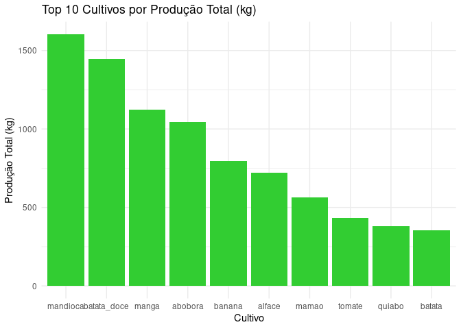
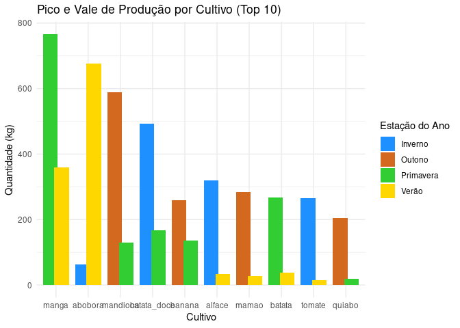
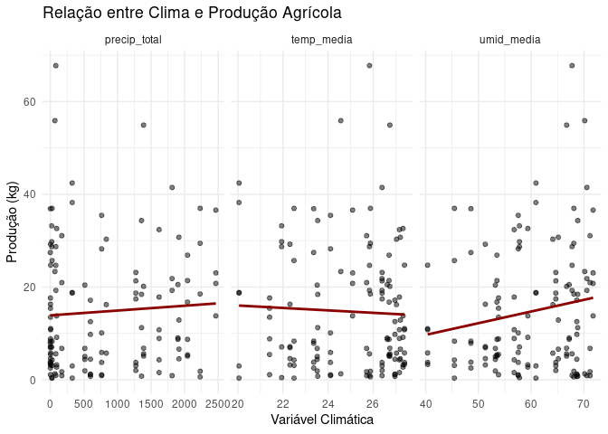

Relatório da Análise Exploratória de Dados - Sítio Mãea Natureza
================
Victor Machado

**Período analisado:** Fevereiro de 2020 a Abril de 2025.

# Objetivo

A partir dos dados de colheita disponibilizados, o objetivo deste
relatório é apresentar os principais achados da análise exploratória de
dados de produção do Sítio Mãea Natureza, destacando cultivos mais
relevantes, padrões sazonais, relações com o clima e recomendações
práticas.

# Resumo

A análise dos dados de colheita do Sítio Mãeã Natureza revelou
informações cruciais sobre a sazonalidade e diversidade de cultivos, o
volume de produção por tipo de cultivo e a frequência das atividades de
colheita. Identificamos um pico na diversidade de cultivos em dezembro
de 2021 que seguido por uma queda considerável. Também foi identificado
a influência de meses mais quentes na variedade de cultivos. Além disso,
a análise detalhou os períodos de pico e vale de produção para os
principais cultivos. Estas descobertas são fundamentais para refinar o
planejamento de plantio, manejo e colheita.

# Cultivos com Maior Volume de Produção

<!-- -->

A produção está fortemente concentrada em poucos cultivos. Mandioca,
batata-doce e manga lideram com larga vantagem em volume produzido,
somando juntos mais de 45% da produção total registrada no período. Em
contrapartida, cultivos como batata e quiabo, embora entre os 10 mais
produzidos, apresentam volumes significativamente menores.

Existe uma clara especialização, com predominância de cultivos de maior
resistência como raízes e frutas tropicais. Essa concentração oferece
muitas vantagens logísticas e operacionais, mas também risco de
dependência de poucos produtos.

**Recomendações:**

- Priorizar investimentos e manejo em cultivos líderes.  
- Avaliar rentabilidade econômica (não apenas volume) para explorar
  potenciais cultivos de maior valor agregado.  
- Investigar os motivos da menor produção dos demais cultivos:
  limitações climáticas, de solo ou de manejo?

# Desempenho dos Principais Cultivos por Estação (Pico e Vale de Produção)

<!-- -->

Fica perceptível que abóbora, tomate e maracujá apresentam grande
variação entre a estação de pico e a de menor produção e requerem um
planejamento rigoroso de plantio e colheita, pois não produzem o ano
inteiro. Banana, coco e mandioca têm variações menores entre estações.
Nota-se também que é no verão que a produção de abóbora e manga atingem
o volume máximo de produção entre todos os cultivos.

A análise por estação nos mostra que nem todos os cultivos seguem o
mesmo ritmo sazonal. Alguns são altamente dependentes do ciclo
climático, enquanto outros oferecem estabilidade, sendo estratégicos
para garantir oferta contínua.

**Recomendações:**

- Escalonar cultivos sazonais para atenuar os vales de produção e evitar
  perda de mercado nos períodos de baixa.  
- Utilizar cultivos de produção estável como carros-chefe — essenciais
  para garantir renda contínua e ocupação do solo durante o ano todo.  
- Criar um calendário produtivo inteligente, organizando o plantio de
  cultivos sazonais em períodos escalonados, com foco em otimizar o uso
  da terra.

# Sazonalidade e Diversidade de Cultivos por Mês

<!-- -->

Há meses com alta diversidade, geralmente entre setembro e fevereiro,
refletindo maior atividade na primavera e verão. Durante o outono e
inverno (abril a agosto), a diversidade de cultivos cai visivelmente,
indicando período de menor variedade produtiva. Apesar da queda, ainda
há registros de produção, sugerindo que certos cultivos persistem mesmo
em épocas climáticas que não são favoráveis.

A diversidade de cultivos varia ao longo do ano, acompanhando o
comportamento climático típico da região. Esse padrão sugere dependência
parcial da estação quente para diversificação, o que pode trazer
vulnerabilidades. Ainda assim, manter mesmo um nível mínimo de
diversidade nos meses frios é uma estratégia positiva de resiliência
produtiva.

**Recomendações:**

- Identificar os cultivos adaptáveis ao inverno e fortalecer seu plantio
  para manter diversidade e oferta contínua.

- Avaliar possibilidades de consórcios e rotação para maximizar uso da
  terra em períodos de menor diversidade.

# Relação com o Clima

<!-- -->

| Variável Climática | Correlação com Produção (kg) |
|:-------------------|-----------------------------:|
| umid_media         |                        0.165 |
| precip_total       |                        0.063 |
| temp_media         |                       -0.043 |

A precipitação não apresenta correlação forte com a produção total. Para
alguns cultivos, os níveis elevados de chuva não resultaram em maior
produtividade. A Temperatura média mostra uma correlação positiva
moderada com a produção em diversos cultivos: aumentos na temperatura
tendem a elevar a produtividade em algumas espécies tropicais. A umidade
relativa revela uma correlação positiva moderada em alguns cultivos,
indicando que a umidade do ar favorece os cultivos.

A temperatura é a variável climática com maior influência sobre a
produção agrícola no sítio, o que é coerente com o perfil de cultivos
adaptados a climas tropicais. Por outro lado, precipitação e umidade
parecem exercer influência mais específica por cultivo, sendo menos
determinantes no conjunto geral.

**Recomendações:**

- Incorporar o monitoramento de temperatura como indicador preditivo de
  produtividade.  
- Avaliar necessidade de controle de umidade em cultivos sensíveis
  (ventilação, sombreamento, cobertura do solo).

# Conclusão

A análise mostra que a produção do Sítio Mãea Natureza está concentrada
principalmente em cultivos como mandioca, batata-doce e manga, que se
destacam em volume colhido. Esses produtos são os que mais rendem na
roça e merecem atenção especial.

Ficou claro também que o clima influencia bastante na produção,
principalmente a temperatura. Quando a temperatura média está mais alta,
a produção costuma melhorar em vários cultivos. Já a chuva e a umidade
não mostraram muita ligação direta com a quantidade colhida — o que pode
indicar que o manejo atual está funcionando bem ou que os cultivos são
mais resistentes, mas ainda precisam de atenção.

A produção varia bastante ao longo do ano, com os meses mais quentes
(primavera e verão) sendo os de maior atividade e colheita. Nos meses
mais frios (outono e inverno), a variedade de cultivos cai, mas ainda
assim há colheita com cultivos que seguem firmes mesmo com o frio.

# Recomendações e Direcionamentos

- Valorizar e investir nos cultivos que mais produzem, como mandioca e
  batata-doce, melhorando o que já está dando certo.

- Aproveitar melhor os meses mais frios, buscando plantar outras
  culturas que aguentam o clima ou usando proteção simples como
  coberturas e túneis.

- Atenção à temperatura: quando ela aumenta, a produção de boa parte dos
  cultivos tendem a subir. Isso pode ajudar a planejar melhor o plantio.

- Organizar o calendário de plantio de modo a distribuir melhor as
  colheitas ao longo do ano e evitar meses de pouca produção.

- Seguir anotando dados da produção e do clima, pois essas informações
  ajudam compreender a evolução do sítio a tomar decisões cada vez mais
  acertadas.
